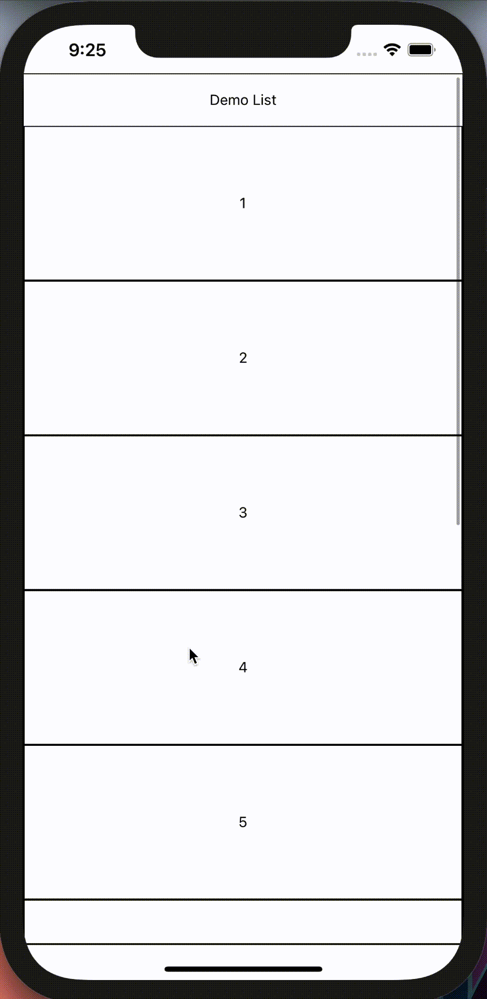

</p>

<h2 align="center">@huds0n/lazy-list</h3>

</p>

<div align="center">

[]()
[](https://github.com/JontiHudson/modules-huds0n-lazy-list/issues)
[](https://github.com/JontiHudson/modules-huds0n-lazy-list/pulls)
[](/LICENSE)

</div>

---

<p align="center"> 
Simplify your lazy loading lists!
</p>

</br>

## 📝 Table of Contents

- [About](#about)
- [Features](#features)
- [Getting Started](#getting_started)
- [Basic Usage](#basic_usage)
  - [LazyGetFunction](#lazy_get_function)
  - [SharedLazyArray](#shared_lazy_array)
  - [LazyList Component](#lazy_list_component)
- [Advanced Usage](#advanced_usage)
  - [Using Typescript](#typescript)
- [Reference](#reference)
  - [LazyList Props](#lazy_list_props)
  - [LazyList Methods](#lazy_list_methods)
- [Example](#example)s
- [Authors](#authors)
- [Acknowledgments](#acknowledgement)

</br>

## 🧐 About <a name = "about"></a>

An automatically lazy loading list based on **@huds0n/components**'s **[FlatList](https://github.com/JontiHudson/modules-huds0n-components#flat-list)** using **[Shared State](https://github.com/JontiHudson/modules-huds0n-shared-state)**.

</br>

## ✅ List of Features <a name = "features"></a>

- **Familiar:** _Extends FlatList and behaves accordingly._
- **Fluid:** _Smoothly lazy loads or refreshes as needed._
- **Universal:** _Data stored independently so can used across multiple components._

</br>

## 🏁 Getting Started <a name = "getting_started"></a>

### **Prerequisites**

Works with any project implementing React 16.8 onwards

</br>

### **Installing**

```
npm i @huds0n/lazy-list
```

</br>

## 🧑‍💻 Basic Usage <a name="basic_usage"></a>

### **LazyGetFunction**<a name="lazy_get_function"></a>

In order for a **LazyList** to work, a **_lazyGetFunction_** needs to be defined. This is a _function_ that returns _data_ on the fly, typically from API services. It receives _**offset**_ and returns an _object_ containing the fetched data (**_data_**) and if data has ended (**_pageEnd_**), either _synchronously_ or _asynchronously_.

```js
const lazyGetFunction = async (offset) => {
  const data = /* data from external API */
  const pageEnd = /* from external API or calculated base on number of elements returned */

  return { data, pageEnd }
};
```

</br>

### **SharedLazyArray**<a name="shared_lazy_array"></a>

**LazyList** uses a **SharedLazyArray** rather than _data_ directly. The **SharedLazyArray** contains the _data_ and, because it is based on **[Shared State](https://github.com/JontiHudson/modules-huds0n-shared-state)**, pushes updates to attached **LazyLists** on data change.

```js
import { SharedLazyArray } from '@huds0n/lazy-list';

const ExampleLazyArray = new SharedLazyArray(lazyGetFunction);
```

</br>

### **LazyList Component**<a name="lazy_list_component"></a>

As stated above **LazyList** does not accept _data_, instead a **SharedLazyArray** is passed.

```jsx
<LazyList
  SharedLazyArray={ExampleLazyArray}
  renderItem={({ item }) => (
    /* rendered item */
  )}
/>
```

Automatically this list will _lazy load_ when _end threshold_ is reached and _refresh_ when _pulled at top_.



</br>

## 🧑‍🔬 Advanced Usage <a name="advanced_usage"></a

### **Using Typescript**<a name="typescript"></a>

**SharedLazyArray** can be easily typed by passing an element type parameter.

```ts
type ExampleElementType = {
  value: number,
  ...ect
}

const ExampleLazyArray = new SharedLazyArray<ExampleElementType>(lazyGetFunction);
```

<br>

## 📖 Reference <a name="reference"></a>

### **LazyList Props**<a name="lazy_list_props"></a>

| Prop      | Description                    | Type                |
| --------- | ------------------------------ | ------------------- |
| data      | Current data array             | _element **array**_ |
| isError   | If list is in an error state   | _boolean_           |
| isLoading | If **lazyGetFunction** running | _boolean_           |
| pageEnd   | If no more data via API        | _boolean_           |

</br>

### **LazyList Methods**<a name="lazy_list_methods"></a>

| Methods/_Param_      | Description                                                           | Return/_Type_                                               |
| -------------------- | --------------------------------------------------------------------- | ----------------------------------------------------------- |
| **lazyGet**          | **Runs lazyGetFunction</br>Returns _null_ is already at pageEnd**     | **{ data: _element array_, pageEnd: _boolean_ } or _null_** |
| _options (optional)_ | _A reset flag can be passed here_                                     | _{ reset?: boolean }_                                       |
|                      |                                                                       |                                                             |
| **Reset**            | **Resets LazyList**                                                   | **void**                                                    |
|                      |                                                                       |                                                             |
| **useArray**         | **Hook at registers a component to update whenever the list changes** | **[LazyList Props](#lazy_list_props)**                      |

</br>

## 📲 Example <a name = "example"></a>

Clone or fork the repo at [https://github.com/JontiHudson/modules-huds0n-lazy-list](https://github.com/JontiHudson/modules-huds0n-lazy-list)

Go to the **\_\_example\_\_** folder. Run **npm install** to install the expo project, then **expo start** to launch the example.

</br>

## ✍️ Authors <a name = "authors"></a>

- [@JontiHudson](https://github.com/JontiHudson) - Idea & Initial work
- [@MartinHudson](https://github.com/martinhudson) - Support & Development

See also the list of [contributors](https://github.com/JontiHudson/modules-huds0n-lazy-list/contributors) who participated in this project.

</br>

## 🎉 Acknowledgements <a name = "acknowledgement"></a>

- Special thanks to my fiance, Arma, who has been so patient with all my extra-curricular work.
